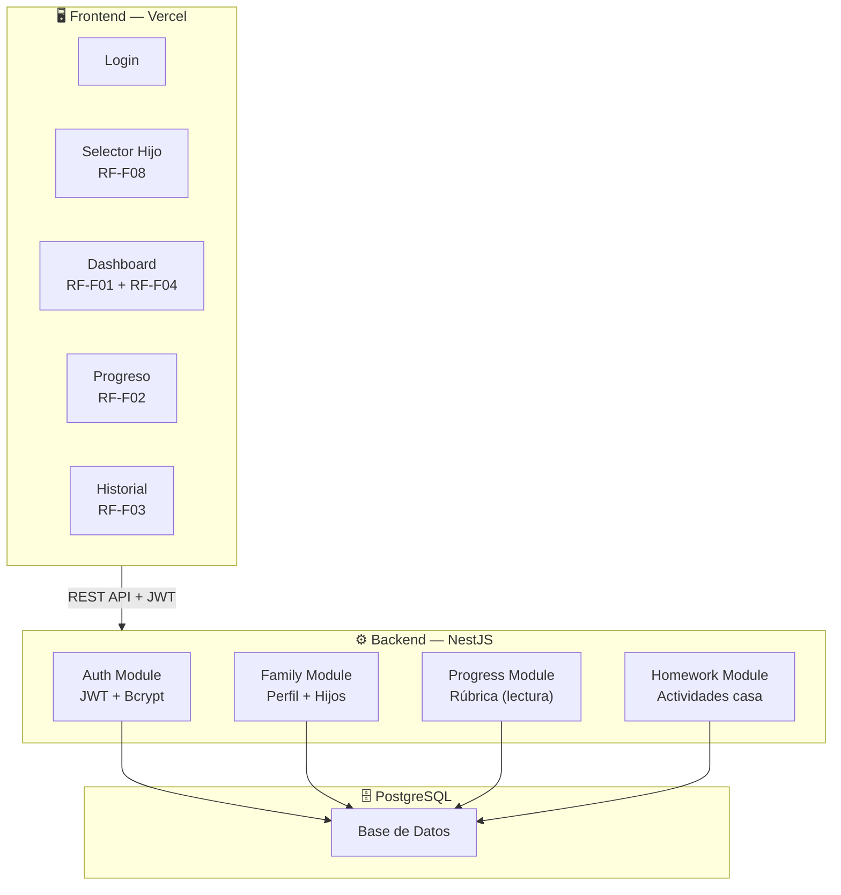
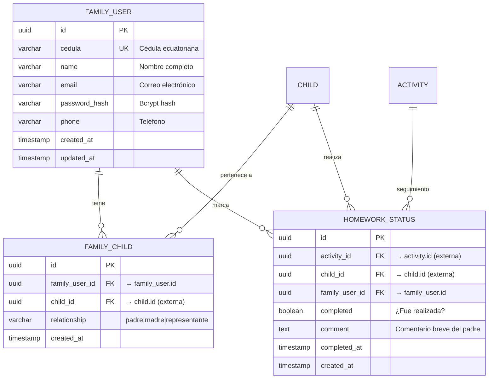
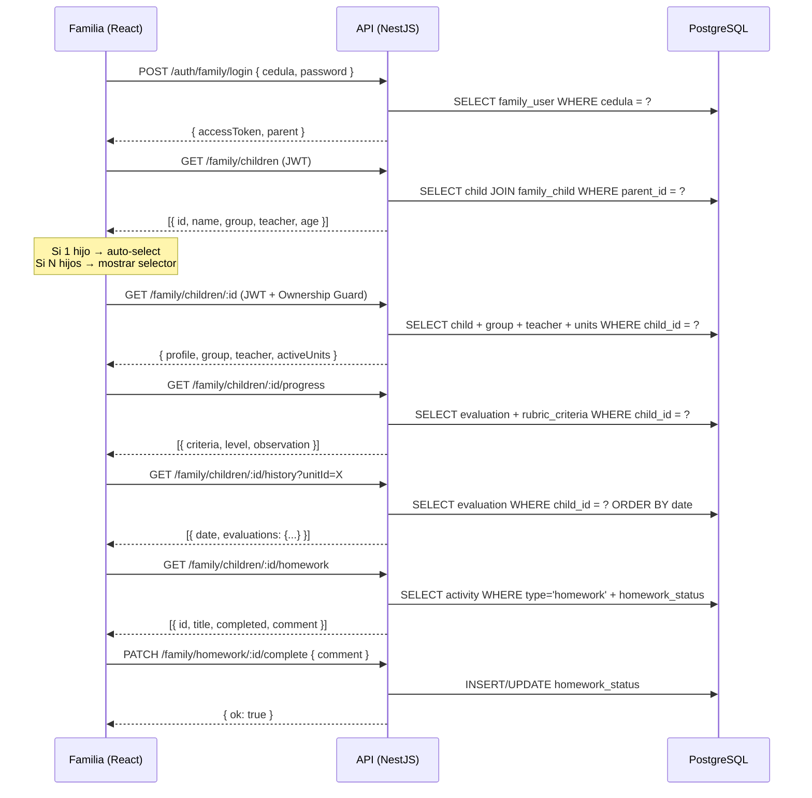

# 🏗️ Arquitectura — Sistema Familia (Semilleros UTN 2026)

> **Proyecto**: Herramienta de apoyo a planificación pedagógica cognitiva para educación inicial.  
> **Alcance**: Módulo Familia (RF-F01 a RF-F08). El Sistema Docente es desarrollado por otro equipo.

---

## Stack Tecnológico

| Capa | Tecnología | Versión |
|------|-----------|---------|
| **Frontend** | React + Vite | React 18, Vite 5 |
| **Routing** | React Router DOM | v6 |
| **Backend** | NestJS | v10 |
| **ORM** | TypeORM | v0.3 |
| **Base de Datos** | PostgreSQL | 15+ |
| **Auth** | JWT + Bcrypt | passport-jwt |
| **Docs API** | Swagger | @nestjs/swagger v7 |
| **Storage** | Cloudinary (opcional) | — |

---

## Diagrama de Arquitectura



---

## 📊 Base de Datos — Solo Módulo Familia

> Solo las **3 tablas** que nosotros creamos y gestionamos.



### Relaciones de nuestras tablas

| Relación | Tipo | Descripción |
|----------|------|-------------|
| `family_user` → `family_child` | 1:N | Un padre tiene 1 o más vínculos a hijos |
| `child` → `family_child` | 1:N | Un hijo puede tener 1 o más representantes |
| `family_user` ↔ `child` | **N:M** | Relación muchos-a-muchos vía `family_child` (multi-hijo) |
| `family_user` → `homework_status` | 1:N | Un padre marca actividades de sus hijos |
| `child` → `homework_status` | 1:N | Cada hijo tiene su propio registro de actividades |
| `activity` → `homework_status` | 1:N | Cada actividad tiene un status por hijo |

### Tablas externas (solo lectura, las crea el otro equipo)

> No las creamos, solo hacemos `SELECT` sobre ellas.

| Tabla externa | Campos que consultamos | Para qué |
|---------------|----------------------|----------|
| `child` | `id, name, age, group_id` | RF-F01: Perfil del hijo |
| `student_group` | `id, name, teacher_id` | RF-F01: Grupo asignado |
| `teacher` | `id, name` | RF-F01: Docente responsable |
| `unit` | `id, title, scope, weeks, status, group_id` | RF-F01: Unidades activas |
| `activity` | `id, title, description, type, deadline, unit_id` | RF-F04: Actividades de casa |
| `rubric_criteria` | `id, key, name, icon, description` | RF-F02: Criterios de rúbrica |
| `evaluation` | `child_id, criteria_id, level, observation, evaluated_at` | RF-F02/F03: Progreso e historial |

---

## 🔌 API Endpoints

### Auth
| Método | Endpoint | Body | Descripción |
|--------|----------|------|-------------|
| `POST` | `/auth/family/login` | `{ cedula, password }` | Login del padre |
| `POST` | `/auth/family/register` | `{ cedula, name, email, password, phone }` | Registro |

### RF-F01: Perfil del Hijo
| Método | Endpoint | Respuesta |
|--------|----------|-----------|
| `GET` | `/family/me` | Perfil del padre logueado |
| `PATCH` | `/family/me` | Actualizar datos del padre |
| `GET` | `/family/children` | Lista de hijos vinculados (RF-F08) |
| `GET` | `/family/children/:childId` | Perfil: nombre, grupo, docente, unidades activas |

### RF-F02: Progreso (Rúbrica)
| Método | Endpoint | Respuesta |
|--------|----------|-----------|
| `GET` | `/family/children/:childId/progress` | 5 criterios con nivel actual + observaciones |

### RF-F03: Historial
| Método | Endpoint | Query | Respuesta |
|--------|----------|-------|-----------|
| `GET` | `/family/children/:childId/history` | `?unitId=X` | Evaluaciones históricas por unidad |

### RF-F04: Actividades para Casa
| Método | Endpoint | Body | Descripción |
|--------|----------|------|-------------|
| `GET` | `/family/children/:childId/homework` | — | Actividades tipo homework |
| `PATCH` | `/family/homework/:id/complete` | `{ comment }` | Marcar como realizada |

---

## 📁 Estructura del Backend (NestJS)

```
semilleros-api/
├── src/
│   ├── main.ts
│   ├── app.module.ts
│   │
│   ├── auth/
│   │   ├── auth.module.ts
│   │   ├── auth.controller.ts
│   │   ├── auth.service.ts
│   │   ├── dto/
│   │   │   ├── login.dto.ts            # { cedula, password }
│   │   │   └── register.dto.ts         # { cedula, name, email, password, phone }
│   │   ├── strategies/
│   │   │   └── jwt.strategy.ts
│   │   └── guards/
│   │       ├── jwt-auth.guard.ts
│   │       └── family-ownership.guard.ts
│   │
│   ├── family/
│   │   ├── family.module.ts
│   │   ├── family.controller.ts         # /family/me, /family/children
│   │   ├── family.service.ts
│   │   ├── dto/
│   │   │   └── update-profile.dto.ts
│   │   └── entities/
│   │       ├── family-user.entity.ts
│   │       └── family-child.entity.ts
│   │
│   ├── progress/
│   │   ├── progress.module.ts
│   │   ├── progress.controller.ts       # /family/children/:id/progress
│   │   ├── progress.service.ts
│   │   └── entities/
│   │       ├── evaluation.entity.ts     # (solo lectura)
│   │       └── rubric-criteria.entity.ts
│   │
│   ├── history/
│   │   ├── history.module.ts
│   │   ├── history.controller.ts        # /family/children/:id/history
│   │   └── history.service.ts
│   │
│   ├── homework/
│   │   ├── homework.module.ts
│   │   ├── homework.controller.ts       # /family/children/:id/homework
│   │   ├── homework.service.ts
│   │   ├── dto/
│   │   │   └── complete-homework.dto.ts # { comment }
│   │   └── entities/
│   │       └── homework-status.entity.ts
│   │
│   └── common/
│       ├── guards/
│       │   └── family-ownership.guard.ts
│       ├── filters/
│       │   └── http-exception.filter.ts
│       └── interceptors/
│           └── transform.interceptor.ts
│
├── docker-compose.yml
├── .env
├── tsconfig.json
└── package.json
```

---

## 📁 Estructura del Frontend (React — Actual)

```
src/
├── App.jsx                     # Rutas + Layout
├── main.jsx                    # Entry point
├── index.css                   # Estilos completos
│
├── context/
│   └── AppContext.jsx          # Estado global + datos mock
│
├── components/
│   ├── Sidebar.jsx             # Navegación desktop
│   └── MobileNav.jsx           # Navegación móvil
│
└── pages/
    ├── Login.jsx               # Auth
    ├── ChildSelector.jsx       # RF-F08: Multi-hijo
    ├── Dashboard.jsx           # RF-F01 (perfil) + RF-F04 (homework)
    ├── Progress.jsx            # RF-F02: Rúbrica cognitiva
    └── History.jsx             # RF-F03: Historial por unidad
```

---

## 🔐 Seguridad

| Aspecto | Implementación | RNF |
|---------|---------------|-----|
| Contraseñas | `bcrypt` (10 salt rounds) | RNF-01 |
| Autenticación | JWT access (15min) + refresh (7d) | RNF-01 |
| Aislamiento | Guard `FamilyOwnership`: valida `family_child(parent_id, child_id)` antes de cada request | RNF-02 |
| Validación | `class-validator` en todos los DTOs | RNF-01 |
| CORS | Solo dominio de Vercel en producción | RNF-01 |
| HTTPS | Forzado en producción | RNF-01 |

### Guard de Ownership (multi-tenant)

```typescript
// Pseudocódigo del guard
@Injectable()
export class FamilyOwnershipGuard implements CanActivate {
  canActivate(context: ExecutionContext): boolean {
    const parentId = request.user.id;        // del JWT
    const childId = request.params.childId;  // de la URL
    
    // Verificar que existe la relación en family_child
    const exists = await familyChildRepo.findOne({
      where: { familyUserId: parentId, childId: childId }
    });
    
    if (!exists) throw new ForbiddenException();
    return true;
  }
}
```

---

## 🐳 Docker Compose (Desarrollo)

```yaml
version: '3.8'
services:
  postgres:
    image: postgres:15-alpine
    environment:
      POSTGRES_DB: semilleros_utn
      POSTGRES_USER: semilleros
      POSTGRES_PASSWORD: semilleros2026
    ports:
      - '5432:5432'
    volumes:
      - pgdata:/var/lib/postgresql/data

  pgadmin:
    image: dpage/pgadmin4
    environment:
      PGADMIN_DEFAULT_EMAIL: admin@utn.edu.ec
      PGADMIN_DEFAULT_PASSWORD: admin123
    ports:
      - '5050:80'

volumes:
  pgdata:
```

---

## 🚀 Despliegue

| Servicio | Plataforma | Tier | URL |
|----------|-----------|------|-----|
| Frontend | **Vercel** | Gratis | `semilleros-utn.vercel.app` |
| Backend NestJS | **Railway** o **Render** | Gratis | `api-semilleros.up.railway.app` |
| PostgreSQL | **Supabase** o **Neon** | Gratis (500MB) | Conexión por env vars |

---

## 📋 Dependencias Backend

```json
{
  "dependencies": {
    "@nestjs/common": "^10",
    "@nestjs/core": "^10",
    "@nestjs/platform-express": "^10",
    "@nestjs/typeorm": "^10",
    "@nestjs/jwt": "^10",
    "@nestjs/passport": "^10",
    "@nestjs/swagger": "^7",
    "typeorm": "^0.3",
    "pg": "^8",
    "passport": "^0.7",
    "passport-jwt": "^4",
    "bcrypt": "^5",
    "class-validator": "^0.14",
    "class-transformer": "^0.5"
  }
}
```

---

## 🔄 Flujo Completo del Sistema



---

## 📊 Rúbrica Cognitiva (5 criterios)

> Definida en la tabla `rubric_criteria`. Configurable desde admin sin cambiar código (RNF-09).

| # | Key | Nombre | Icono | Descripción |
|---|-----|--------|-------|-------------|
| 1 | `clasificacion` | Clasificación | 🧩 | Agrupa objetos por atributos |
| 2 | `seriacion` | Seriación | 📊 | Ordena elementos progresivamente |
| 3 | `construccion` | Construcción de conocimiento | 🧠 | Asimilación y acomodación |
| 4 | `pensamiento` | Pensamiento lógico | 🔍 | Justificación lógica |
| 5 | `metacognicion` | Metacognición | 🪞 | Autorregulación |

| Nivel | Key | Visual |
|-------|-----|--------|
| Iniciado | `iniciado` | 🔴 Necesita apoyo constante |
| En Proceso | `en_proceso` | 🟡 Apoyo parcial |
| Logrado | `logrado` | 🟢 Autónomo |
